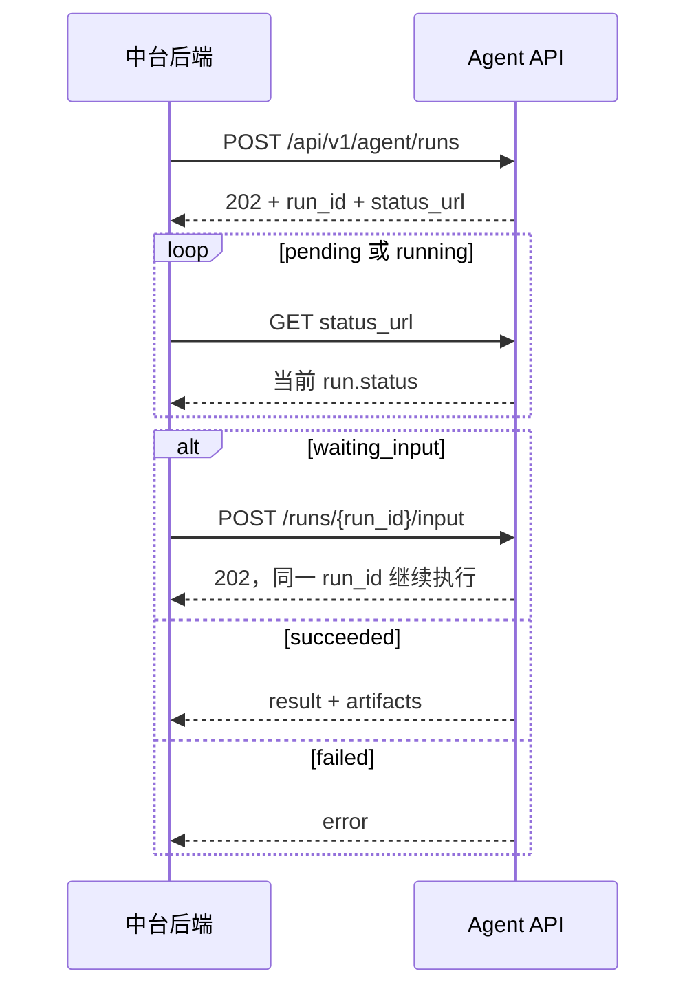

# 直播数据分析 Agent HTTP 接口文档

> 接口版本：`v1`<br>
> 契约状态：已冻结，供中台开发联调<br>
> 更新日期：2026-08-06<br>
> 字符编码：UTF-8，JSON 请求和响应均使用 `application/json`

本接口供直播中台后端调用。生产地址记为 `{BASE_URL}`，例如
`http://agent-api.internal.example.com:8000`。响应中的 `status_url` 和
`download_url` 都是以 `/` 开头的服务根路径相对地址，调用时使用
`{BASE_URL}{相对地址}`。建议通过独立内网域名从根路径代理，不要额外挂载路径前缀。

接口字段名为固定英文协议字段，不能翻译；用户可见的分析正文、业务名称、结论、标签及
生成的 Excel 展示内容使用简体中文。

## 稳定接口清单

| 用途 | 方法与路径 | 成功状态 |
|---|---|---|
| 创建分析任务 | `POST /api/v1/agent/runs` | 新任务或执行中 `202`；幂等重放至等待/终态 `200` |
| 查询任务 | `GET /api/v1/agent/runs/{run_id}` | 找到任务 `200` |
| 回答澄清 | `POST /api/v1/agent/runs/{run_id}/input` | 首次接受或执行中 `202`；幂等重放至等待/终态 `200` |
| 下载结果文件 | 使用 `run.result.artifacts[].download_url` | 文件流 `200`、JSON `200` 或 OSS 跳转 `307` |
| 健康检查 | `GET /health`、`GET /ready` | 见“健康检查”一节 |

`/api/chat`、网页会话接口和调试页面不属于中台稳定 API，禁止新客户端接入。

## 接入前提

- 生产环境使用 `XPD_IDENTITY_MODE=user_id`。
- 中台后端完成用户登录认证后，将稳定的用户标识放入 `X-User-Id`。
- 生产环境设置 `XPD_SERVICE_AUTH_ENABLED=true` 和独立的高强度
  `XPD_SERVICE_API_KEY`。中台后端调用所有公开 `/api/*` 接口时都必须携带
  `Authorization: Bearer <service-key>`。
- `X-User-Id` 只表示用户身份范围，不是调用凭证。服务密钥仍应配合内网或 API 网关，
  禁止浏览器和其他客户端直接伪造身份头。
- 生产环境必须长期固定 `XPD_SESSION_SIGNING_SECRET`。更换它会改变用户作用域，旧会话和旧任务将无法按原用户查询。
- 当前 Agent run 状态保存在本机文件。FastAPI 必须保持单 worker、单 ECS 实例并使用持久化磁盘；迁移到共享数据库前禁止多 worker、多实例部署。
- 同一 `session_id` 同时只允许一个未完成业务轮次，包括 `waiting_input` 状态。中台必须按会话串行提交，前一任务完成或澄清结束后再提交下一轮。

### 公共请求头

| 请求头 | 是否必填 | 约束与用途 |
|---|---|---|
| `Authorization` | 生产必填 | `Bearer <service-key>`；缺失或错误返回 `401 SERVICE_AUTH_FAILED` |
| `X-User-Id` | 必填 | 1–128 字符，不得含空白或控制字符；使用稳定、不含手机号/姓名等隐私的中台内部 ID |
| `Idempotency-Key` | POST 必填 | 1–255 个可见 ASCII 字符，不得含空格、中文或控制字符；推荐 UUID |
| `X-Request-Id` | 可选 | 1–128 字符；首字符为字母或数字，其余仅允许字母、数字、`.`、`_`、`:`、`-` |

缺少必填头通常返回 `422 VALIDATION_ERROR`；已经传入但格式非法的幂等键返回
`400 INVALID_IDEMPOTENCY_KEY`。非法或缺失的 `X-Request-Id` 不会导致失败，服务会生成
`req_<32位十六进制>` 并在响应头返回。

### 主流程



## 提交分析

```http
POST /api/v1/agent/runs
Authorization: Bearer <service-key>
X-User-Id: <中台登录用户ID>
Idempotency-Key: <本次业务请求的稳定唯一ID>
X-Request-Id: <可选；本次HTTP调用的链路追踪ID>
Content-Type: application/json
```

```json
{
  "session_id": "可选；继续历史对话时填写",
  "title": "可选；首次创建会话时使用",
  "message": "分析最近30天直播场次退货情况并生成Excel"
}
```

| 字段 | 类型 | 必填 | 约束 |
|---|---|---|---|
| `message` | string | 是 | 1–100000 字符；中台必须先去除首尾空白并拒绝纯空白 |
| `session_id` | string | 否 | 最长 200；继续多轮对话时传上一轮返回值，空值应直接省略 |
| `title` | string | 否 | 最长 120；只在创建新会话时生效 |

未传 `session_id` 时，服务会根据用户范围和 `Idempotency-Key` 幂等创建会话。首次接受任务或任务仍在执行时返回 `202 Accepted`：

```json
{
  "ok": true,
  "run": {
    "run_id": "run_...",
    "request_id": "req_...",
    "idempotency_key": "...",
    "session_id": "xpd_...",
    "status": "pending",
    "attempt_count": 0,
    "clarification": null,
    "error": null,
    "result": null,
    "created_at": "2026-08-05T09:00:00+00:00",
    "updated_at": "2026-08-05T09:00:00+00:00",
    "started_at": null,
    "completed_at": null
  },
  "status_url": "/api/v1/agent/runs/run_..."
}
```

相同用户、相同会话和相同 `Idempotency-Key` 下：

- `message` 相同：返回原 `run_id` 和原状态，不重复执行。
- `message` 不同：返回 `409 IDEMPOTENCY_CONFLICT`。
- `title` 只是首次创建会话时的元数据，不参与分析请求的幂等比较；重复请求修改 `title` 不会创建新分析。

对已结束的任务重复提交时返回 `200 OK`，响应中仍是原 `run_id` 和终态结果。

多轮对话的正确做法是：第一轮不传 `session_id`；保存响应中的
`run.session_id`；等待本轮结束；下一轮传回该 `session_id` 并使用全新的
`Idempotency-Key`。HTTP 超时重试则必须复用原 Key，不能生成新 Key。

同一会话禁止并发或交错提交多个未完成任务。当前服务会串行执行，但不会主动拒绝第二个
任务；尤其前一任务处于 `waiting_input` 时交错提交可能污染会话上下文和文件边界。

## 查询状态和结果

```http
GET /api/v1/agent/runs/{run_id}
Authorization: Bearer <service-key>
X-User-Id: <与提交时相同的用户ID>
X-Request-Id: <可选；本次轮询调用的链路追踪ID>
```

状态为：

- `pending`：已持久化，等待执行。
- `running`：正在执行或服务正在核对 Hermes 中的执行结果。
- `waiting_input`：遇到会改变 SQL 或指标口径的关键歧义；读取
  `run.clarification`，提交回答后继续同一个 `run_id`。
- `succeeded`：成功终态，读取 `run.result`。
- `failed`：失败终态，读取 `run.error`。

`GET` 找到任务时始终返回 `200 OK` 和 `ok=true`。这只代表“状态查询成功”，不代表分析成功；中台必须以 `run.status` 判断业务结果。

`run` 的完整公共字段为：`run_id`、`request_id`、`idempotency_key`、
`session_id`、`status`、`attempt_count`、`clarification`、`error`、`result`、
`created_at`、`updated_at`、`started_at`、`completed_at`。时间字段是 ISO 8601 字符串。
`attempt_count` 是 Agent 实际执行腿数总计，既包括安全重试，也包括澄清后的继续执行，
不能当成失败次数或用户提问次数。

成功时 `run.result` 包含：

- `session_id`
- `content`
- `analysis`：结构化分析对象
- `reasoning`
- `usage`
- `artifacts`
- `recovered`：结果是否由服务重启后的会话历史核对恢复

`content` 是面向用户展示的中文正文。`reasoning` 是内部诊断信息，不得直接展示给终端用户，
也不得作为业务结论；`usage` 是供应商相关的自由结构，不能假定固定字段。

`analysis` 的完整顶层字段如下：

| 字段 | 说明 |
|---|---|
| `schema_version` | 当前为 `1.2`；客户端必须允许后续新增字段 |
| `structured` | 是否成功得到可校验的结构化分析 |
| `analysis_type` | `query`、`comparison` 或 `diagnosis` |
| `conclusion` | 核心结论 |
| `data_period`、`data_scope` | 数据期间、时区、粒度、过滤条件、维度、来源表和去重口径 |
| `metrics`、`metric_definitions` | 指标值及公式、聚合方式、分子分母和统计粒度 |
| `comparisons`、`trends` | 基准对比和分期趋势 |
| `insights`、`drivers`、`anomalies` | 数据洞察、驱动因素和异常项 |
| `recommendations` | 行动建议、理由和优先级 |
| `assumptions`、`limitations` | 分析假设和限制 |
| `data_quality` | 空结果、覆盖率、截断、空值、零分母、小样本和告警等质量信息 |
| `executed_queries` | SQL、校验状态、返回行数、是否截断和耗时；仅限有权限的内部页面使用 |
| `sql` | 兼容 `1.0` 客户端的 SQL 数组，新客户端优先使用 `executed_queries` |

`structured=false` 表示模型未返回可校验的结构化块，服务已降级为文本结论；
中台可继续展示 `content`，但不应把空指标解读为“业务指标为零”。

`baseline_value`、`absolute_change`、`relative_change` 为 `null`，或者
`comparisons/trends` 为空时，也不表示数值为 0。常见原因是查询期间没有足够的上一周期数据、
分母为 0、样本过小或结果为空；中台应同时展示 `limitations` 和 `data_quality.warnings`。
当数据库积累了覆盖当前期和基准期的多月数据后，这些字段可以正常计算。

### 提交澄清回答

当状态为 `waiting_input` 时，`run.clarification` 包含 `clarification_id`、
`question`、最多 4 个 `choices` 和 `requested_at`。回答必须使用新的、稳定的幂等键：

```http
POST /api/v1/agent/runs/{run_id}/input
Authorization: Bearer <service-key>
X-User-Id: <与提交时相同的用户ID>
Idempotency-Key: <本次回答的稳定唯一ID>
Content-Type: application/json

{"answer":"按件数"}
```

`answer` 为 1–2000 字符，中台应先去除首尾空白。`choices` 最多 4 个且可能为空，
回答不要求必须等于某个选项。请求体不包含 `clarification_id`；服务根据当前 run 的等待状态
关联回答。同一个 run 可能连续出现多轮澄清，每轮都要使用新的回答幂等键。

首次接受回答返回 `202` 并将同一任务重新置为 `pending/running`；相同键和相同回答重放
返回当前任务且不会重复执行，同一键改用不同回答返回 `409 INPUT_IDEMPOTENCY_CONFLICT`。
非 `waiting_input` 状态提交新回答返回 `409 AGENT_RUN_NOT_WAITING_INPUT`。等待输入不会占用
Agent 并发槽，服务重启也不会自动重放原请求。

### 下载结果文件

`run.result.artifacts` 只包含本次 run 新生成的文件。每项主要字段包括
`artifact_id`、`session_id`、`filename`、`format`、`media_type`、`size_bytes`、
`created_at`、`download_url`、`storage`、`oss_uri` 和 `object_key`。
其中 `created_at` 是 Unix 秒级时间戳；当前支持 CSV、XLSX、Markdown、PDF 和 JSON。

`artifacts[].download_url` 始终是 Agent 服务提供的稳定相对地址，不是 OSS 签名直链。
中台应把它当作不透明地址，禁止自行拼接；首次访问必须携带 Bearer 和原 `X-User-Id`：

```http
GET {BASE_URL}/api/sessions/{session_id}/artifacts/{artifact_id}/download
Authorization: Bearer <service-key>
X-User-Id: <与任务相同的用户ID>
```

| 存储模式与请求 | 服务响应 | 客户端处理 |
|---|---|---|
| 本地存储 | `200` 文件流 | 保存响应体 |
| OSS，普通 GET | `307` 到本次新生成的临时签名 URL | 允许跳转；跳到 OSS 后不要转发 Agent 身份头 |
| OSS，`Accept: application/json` | `200`，返回临时 URL 和过期时间 | 再用无 Agent 身份头的 GET 请求 OSS |

JSON 模式响应：

```json
{
  "ok": true,
  "filename": "直播退货诊断.xlsx",
  "download_url": "https://<bucket>.<oss-endpoint>/<object>?<签名参数>",
  "download_url_expires_at": "2026-08-06T10:00:00+00:00"
}
```

每次访问稳定下载地址都会生成新的 OSS 签名。不需要、也不能通过重新轮询任务状态刷新签名。
状态结果里的 `download_url_expires_at` 可能为 `null`；真正的过期时间以上述 JSON 响应为准。
跨主机跟随 `307` 时必须确认 HTTP 客户端不会把 `Authorization` 或 `X-User-Id` 转发给 OSS。

服务默认最多同时执行 3 个 Agent 任务；超出部分保持 `pending`，获得执行槽后才进入 `running`。

异步任务失败仍是一次成功的状态查询，例如：

```json
{
  "ok": true,
  "run": {
    "run_id": "run_...",
    "status": "failed",
    "attempt_count": 2,
    "result": null,
    "error": {
      "code": "HERMES_UNAVAILABLE",
      "message": "...",
      "retryable": true,
      "outcome_unknown": false,
      "request_id": "req_..."
    }
  }
}
```

### 建议轮询节奏

1. 收到 `202` 后等待 1 秒再首次查询。
2. `pending/running` 时按 1、2、4、5 秒退避，之后最多每 5 秒查询一次。
3. 单次轮询遇到网络错误或 `502/503/504` 时，仅重试同一个 `run_id`，按 2、4、8 秒退避，最长 30 秒。
4. 中台自身等待超时不会取消服务端任务。保留 `run_id`，稍后继续查询，不能因此生成新的幂等键重新分析。
5. 到达 `waiting_input` 时停止轮询并展示问题；提交回答成功后恢复轮询。
6. 到达 `succeeded/failed` 后停止轮询。

## HTTP 错误与重试

HTTP 请求本身失败时统一返回：

```json
{
  "ok": false,
  "error": {
    "code": "HERMES_UNAVAILABLE",
    "message": "...",
    "retryable": true,
    "outcome_unknown": false,
    "request_id": "req_..."
  },
  "detail": {}
}
```

中台只能根据 `error.code`、`retryable` 和 `outcome_unknown` 分支。`message` 用于展示，`detail` 是兼容诊断字段且结构不稳定，不应作为程序判断依据。

常见 HTTP 状态：

| HTTP | 典型错误码 | 处理方式 |
|---|---|---|
| `400` | `INVALID_IDEMPOTENCY_KEY`、`INVALID_CLARIFICATION_INPUT`、`HERMES_BAD_REQUEST` | 修正请求，不重试原错误请求 |
| `401` | `SERVICE_AUTH_FAILED`、`UNAUTHORIZED` | 检查 Bearer、`X-User-Id` 和生产身份配置 |
| `404` | `AGENT_RUN_NOT_FOUND` | 检查 `run_id` 与 `X-User-Id` 是否属于同一用户 |
| `409` | `IDEMPOTENCY_CONFLICT`、`INPUT_IDEMPOTENCY_CONFLICT`、`AGENT_RUN_NOT_WAITING_INPUT`、`SESSION_CLOSED` | 不自动重试；修正业务请求或刷新任务状态 |
| `422` | `VALIDATION_ERROR` | 修正请求体 |
| `500` | `INTERNAL_ERROR` | 记录 Request ID、告警并人工排查 |
| `502/503/504` | `HERMES_*`、`AGENT_RUN_STATE_UNAVAILABLE` | 按响应中的两个布尔字段处理 |

重试决策矩阵：

| `retryable` | `outcome_unknown` | 中台动作 |
|---|---|---|
| `false` | `false` | 停止自动重试，修正请求/配置或转人工 |
| `true` | `false` | 可用完全相同的请求和相同幂等键重试 |
| 任意值 | `true` | 不自动重放；已知 `run_id` 时继续查询原任务，否则仅用原幂等键核对 |

### `retryable` 的准确含义

- 对尚未得到 `run_id` 的 POST HTTP 错误，`retryable=true, outcome_unknown=false` 时，使用原请求和相同 `Idempotency-Key` 重试。
- 对 `run.status=failed`，`retryable=true, outcome_unknown=false` 表示失败原因可能是临时性的，但不保证该 run 仍有剩余尝试次数。服务会先执行配置允许的内部重试。
- 中台可以用相同幂等键再提交一次：若返回 `202/pending/running`，恢复轮询；若仍返回 `200/failed`，说明原 run 已是终态或次数已耗尽，必须停止自动重试并告警或转人工。
- 不得通过不断生成新幂等键绕过次数上限，否则可能重复分析、重复写记忆或重复生成文件。

### `outcome_unknown` 的准确含义

`outcome_unknown=true` 表示 Hermes 可能已经收到请求，自动重放存在重复执行风险：

- 已知 `run_id`：继续查询该 `run_id`。若最终仍为 `failed + outcome_unknown=true`，停止自动操作，展示人工确认状态。
- 初始 POST 没有返回 `run_id`：只能使用原请求和相同 `Idempotency-Key` 重新查询式提交；不能生成新 Key。
- 人工确认 Hermes 会话中没有对应结果后，才可以由操作者明确发起一个新的业务请求和新幂等键。

参数、身份、权限、SQL 语义和幂等冲突等确定性错误不应自动重试。

## Request ID 语义

- HTTP 响应头 `X-Request-Id` 对应当前这一次 HTTP 调用。调用方传入合法值时服务原样返回，否则服务生成新值。
- `run.request_id` 是首次创建该 run 时的请求 ID，重复提交相同幂等键时保持不变，用于追踪原始执行。
- `Idempotency-Key` 标识业务执行，`X-Request-Id` 标识一次传输尝试，两者不能互相替代。

## 本地与生产身份

本地 `session_key` 模式使用 `X-XPD-Session-Key`。生产 `user_id` 模式使用 `X-User-Id`。跨用户查询统一返回 `404`，避免泄露其他用户的 `run_id` 是否存在。

Agent 通过独立 Bearer 密钥校验中台服务身份，再使用 `X-User-Id`
划分用户数据。两者必须同时提供：Bearer 密钥不能代替用户作用域，
`X-User-Id` 也不能当成密码或鉴权凭证。未配置服务密钥时生产服务会拒绝启动。

FastAPI 在 `/docs` 和 `/openapi.json` 提供接口定义。正式中台客户端应只依赖
`/api/v1/agent/runs`、状态查询及 `/input` 契约；网页调试接口不属于稳定中台 API。

## 健康检查

| 接口 | HTTP 语义 | 用途 |
|---|---|---|
| `GET /health` | 进程可响应时返回 `200`，必须继续读取 body 中的 `ok` | systemd 存活检查和运维诊断；会检查 Hermes 及工具能力 |
| `GET /ready` | runtime 与真实 MySQL `SELECT 1` 均成功时 `200`，否则 `503` | SLB/Nginx 流量就绪与摘流 |

`/ready` 只证明数据库能建立连接并执行常量查询，不证明业务账号可以读取目标表。
上线验收还必须通过 Agent 发起一次真实业务表只读查询。两个端点会返回内部诊断信息，
只允许运维网段或内网访问。负载均衡健康探针建议超时至少 15 秒、间隔约 30 秒。

## 当前容量和超时边界

- 默认全局同时执行 3 个 Agent 任务，超量任务保持 `pending`；接口没有进度百分比、取消、回调或 `Retry-After`。
- 单次 Agent 执行默认超时 600 秒；排队、内部重试和澄清会让端到端时长超过 10 分钟。
- 中台 HTTP 等待超时不会取消服务端任务，必须保存 `run_id` 并继续轮询。
- `waiting_input` 不占并发槽且当前不会自动过期。
- 正式高并发或多实例上线前，需要把 run 状态迁移到共享数据库，并补充队列上限、限流和状态保留策略。

## 中台联调验收清单

- [ ] Bearer 密钥只保存在中台服务端，不下发浏览器。
- [ ] `X-User-Id` 稳定且不含个人敏感信息，所有后续调用使用同一值。
- [ ] 每个新业务轮次生成新幂等键；HTTP 重试复用原键。
- [ ] 保存 `run_id`、`session_id`、`status_url` 和首次 `request_id`。
- [ ] 同一会话严格串行；正确处理五种 `run.status`。
- [ ] `waiting_input` 停止轮询，提交答案后恢复轮询。
- [ ] `structured=false` 或对比字段为 `null` 时，不按 0 展示。
- [ ] 文件下载支持 `307`，且不会把 Agent 身份头转发到 OSS。
- [ ] `/ready` 通过，并完成一次真实业务表只读查询。
- [ ] 生产进程保持单 worker、单 ECS，run 状态目录位于持久化磁盘。
