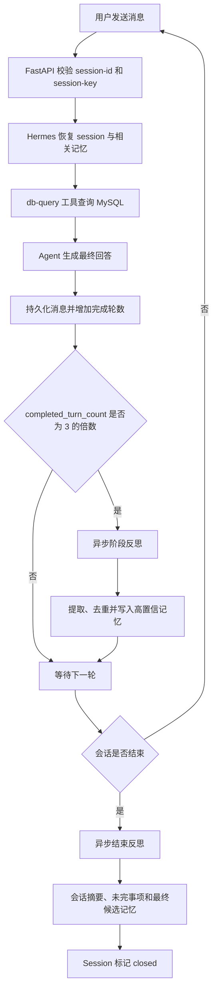

# xpd-report-agent 会话记忆与反思能力 PRD

## 文档信息

- 版本：V1.5
- 状态：实施中
- 日期：2026-08-04
- 对应分支：`feature/session-memory-reflection`
- 范围：需求定义与一期实现跟踪

## 一期实现记录（2026-08-04）

本分支已完成本轮要求的后端核心能力与历史记录前端：

- Hermes API Server 已开启 `db_query`、`session_search`、`memory`，健康检查将三者作为必需能力。
- FastAPI 已封装 Hermes 原生 Session 创建、列表、详情、消息、聊天、重命名、关闭和删除接口。
- 前端不再发送完整 `history`，仅发送当前消息、session-id 和本地 session-key。
- session-key 经服务端 HMAC 转换为 owner scope，未授权的 session-id 在访问 Hermes 前即被拒绝。
- 每 3 轮复盘复用 Hermes 原生 memory review；会话结束复盘使用异步、幂等、可重试的持久任务。
- 结束复盘前执行凭据脱敏，临时复盘 Session 完成后删除，不在用户消息流显示复盘内容。
- 服务端提供 30 分钟空闲关闭扫描；重启时恢复未完成的最终反思任务。
- 页面侧边栏已提供历史会话、新建、打开、重命名、结束和删除；刷新可恢复当前会话消息。
- 对话页已将 Hermes 返回的模型思考原文与最终答案分区展示；思考区默认折叠、可手动展开，
  流式生成和历史会话恢复均支持。根据用户确认，展示前不做脱敏、摘要或内容过滤。
- 同一轮对话中因工具调用产生的多个 Assistant 思考片段合并到一个折叠窗口；该轮只展示最后
  一条正式答案，避免历史恢复后出现大量零散思考卡片。
- `db-multitable-query` Skill 的描述和执行规则已改为中文；工具名、表名、字段名和 SQL 标识
  保持原文。系统提示词与 Skill 同时要求新生成的 reasoning、thinking、工具说明和答案使用中文。

- 页面已增加“Agent 记忆”入口，只读、原样展示 Hermes 当前的 `MEMORY.md` 和 `USER.md`，
  同时显示字符容量、整理水位、文件状态和最后更新时间，并支持手动刷新观察反思写入。
- 根据 2026-08-04 的范围确认，本期不提供人工编辑、删除、清空或逐条记忆治理能力。
  Hermes 原生 `memory` 仍是长期记忆的唯一写入方。

## 背景

当前 xpd-report-agent 通过 FastAPI Wrapper 转发 Hermes Agent 请求，前端只在当前
页面的 JavaScript 内存中保存对话历史。存在以下问题：

- 刷新页面或关闭浏览器后，当前对话历史丢失。
- 请求没有稳定的 session-id，无法精确恢复或追溯某次对话。
- 前端每次携带完整 `history`，客户端和 Hermes 之间没有唯一的会话事实源。
- Hermes 底层具备持久记忆和后台复盘能力，但当前 API 工具面只开放
  `db_query`，报表 Agent 尚未形成“反思—提炼—写入记忆—后续调用”闭环。
- 没有明确的会话结束事件，因此无法保证每次对话结束都执行最终反思。
- 记忆内容没有来源、置信度、去重、更新和删除规则，容易累积错误或过期信息。

## 产品目标

1. 开启 Hermes 原生 `session_search` 工具面，为每次对话建立稳定的 session-id，并支持追溯、恢复和搜索历史对话。
2. 开启 Hermes 原生 `memory` 工具面，将其作为跨会话长期记忆的唯一事实源。
3. 用户刷新页面或重新打开应用后，可继续原会话或查看历史会话。
4. 每完成 3 轮有效对话，调用 Hermes 原生反思/记忆链路执行一次后台阶段反思。
5. 每次会话结束时，调用 Hermes 原生反思/记忆链路执行一次会话级最终反思。
6. 将反思结果分类为会话摘要、用户偏好、稳定业务口径、成功经验、失败教训和待办问题。
7. 新会话可在权限允许时通过 `session_search` 召回历史对话，并通过 `memory` 读取经提炼的长期记忆。
8. 用户能在前端原样查看 `MEMORY.md` 和 `USER.md` 的当前内容与容量，便于测试和观察反思结果。
9. 用户能查看当前模型返回的思考过程；思考与最终答案分离且默认折叠。

## 非目标

- 不把最终反思任务的隐藏思维过程写入长期记忆；反思只保存结构化结论和可审计依据。
- 对话模型通过 Hermes 明确返回并持久化的 `reasoning` / `reasoning_content` 作为调试信息展示，
  不等同于最终反思任务的内部过程。
- 不允许反思 Agent 自动修改代码、Skill、系统提示词或 MySQL 业务数据。
- 不在本期建设跨组织、跨用户的共享记忆库。
- 不在本期引入独立向量数据库；优先复用 Hermes 原生会话与记忆能力。
- 不重新实现 Hermes 已有的 `session_search` 和 `memory`；FastAPI Wrapper 只负责开启、透传、作用域校验和界面封装。
- 不把报表查询返回的大量原始明细作为长期记忆。
- 不在本期完成账号中心和完整的多租户权限系统。

## 产品原则

### 会话是事实源

引入 session-id 后，Hermes 会话记录是消息历史的唯一事实源。前端不再向每次
请求重复传送完整历史，只传递当前消息和 session-id。

### 记忆必须可追溯

每条长期记忆必须能追溯到来源 session-id、来源轮次、反思任务和写入时间。
无来源的内容不得自动晋升为长期记忆。

### 反思不阻塞回答

阶段反思和结束反思默认在后台异步执行。反思失败不得导致用户当前回答失败，
也不得阻塞会话关闭。

### 少而准，不求多

反思不是对对话内容的机械摘抄。只保存未来会话可复用、稳定且有足够置信度的信息。

## 关键概念

### 一轮对话

“一轮”定义为：一条用户消息加上一条成功完成的 Agent 最终回答。

- 流式输出成功结束后计为一轮。
- 中断、超时、用户取消或 Agent 未产生最终回答时不计入。
- 用户重试后成功的回答计入一轮，但失败尝试保留为可审计事件。

### 会话结束

以服务端事件为权威判定，包括：

1. 用户点击“新建对话”，原会话先关闭再创建新会话。
2. 用户主动点击“结束对话”。
3. 会话超过配置的空闲时间，由服务端关闭。建议默认为 30 分钟。
4. 用户删除会话前，若该会话尚未关闭，先触发一次结束反思。
5. 服务正常关闭时，尝试关闭仍活跃的会话；异常崩溃后由恢复任务补做。

浏览器标签页关闭不作为唯一的结束依据。`sendBeacon` 只能作为加速信号，
服务端空闲超时才是兜底机制。

### 反思

反思是对已完成对话的结构化复盘，不向用户暴露模型隐藏思维过程。反思输出包含：

- 对话目标和已完成结果。
- 已确认的用户偏好、业务口径或约束。
- 成功的查询或问题解决策略。
- 错误、纠正、失败原因和后续应避免的行为。
- 尚未解决的问题和可继续工作的下一步。
- 候选长期记忆及其类型、来源和置信度。

## 记忆分层

| 层级 | 内容 | 作用域 | 默认保留 | 说明 |
|---|---|---|---|---|
| L0 原始消息 | 用户、Agent 和工具消息 | session-id | 90 天 | 用于恢复、审计和重做反思 |
| L1 会话摘要 | 目标、结论、待办、关键口径 | session-id | 180 天 | 用于快速恢复长对话 |
| L2 用户画像 | 稳定偏好、输出风格、默认选择 | user/session-key | 直到删除 | 只保存跨会话稳定信息 |
| L3 长期经验 | 稳定业务口径、成功策略、失败教训 | agent/user | 直到失效或删除 | 后续会话按需检索 |
| L4 临时工作记忆 | 当前任务状态和上下文压缩结果 | session-id | 会话期间 | 不自动晋升为长期记忆 |

保留期必须可配置，用户主动删除的优先级高于默认保留策略。

## 核心用户故事

### US-01 继续对话

作为用户，我希望刷新页面后仍能继续上一次对话，不必重复说明背景。

### US-02 查看历史

作为用户，我希望查看历史会话列表、时间、标题、状态和消息，并可重新打开。

### US-03 阶段复盘

作为 Agent 管理者，我希望每完成 3 轮对话就在后台反思一次，及时记录用户的
纠正、稳定偏好和有效查询方式。

### US-04 结束复盘

作为 Agent 管理者，我希望每次对话结束都产生一份最终摘要和候选记忆，以便下次对话
能够继承有价值的经验。

### US-05 管理记忆

作为用户，我希望知道 Agent 记住了什么，并能删除错误、过期或不希望保存的内容。

## 功能需求

### FR-HERMES-001 开启 Hermes 原生能力

- Hermes API Server 工具面必须从当前仅有 `db_query` 扩展为至少包含 `db_query`、`session_search` 和 `memory`。
- `session_search` 是历史对话的搜索、浏览和按 session-id 回溯工具，不在项目内重新实现另一套搜索引擎。
- `memory` 是跨会话长期记忆的读写工具，反思产生的高置信记忆必须写入 Hermes 原生记忆存储。
- FastAPI 健康检查必须将 `session_search` 和 `memory` 列为必需工具，缺失任意一项时标记 Agent 记忆能力不完整。
- 系统提示词必须明确区分：过往对话原文使用 `session_search`，跨会话稳定记忆使用 `memory`。

### FR-SESSION-001 创建会话

- 用户首次进入聊天页或点击“新建对话”时，由服务端创建 session。
- session-id 必须由服务端生成，全局唯一、不可猜测、可安全用于 URL 和请求头。
- 优先复用 Hermes 原生 session 资源 API，不在 Wrapper 内建立第二套消息事实源。
- FastAPI 返回 session-id，前端保存当前 session-id，但不以前端存储作为唯一恢复手段。

### FR-SESSION-002 继续会话

- 前端向 FastAPI 传递 session-id。
- FastAPI 通过 `X-Hermes-Session-Id` 或 Hermes 原生 session chat API 继续对话。
- Hermes 响应返回的有效 session-id 为准；如果压缩或恢复产生新 session-id，前端必须更新。
- 当使用 session-id 继续时，请求体不再发送完整 `history`，避免重复消息。

### FR-SESSION-003 历史会话

- Agent 浏览、搜索或按 session-id 回溯历史对话时，必须使用 Hermes 原生 `session_search`。
- 提供会话列表，包含 session-id、标题、创建时间、最后活跃时间、状态和轮数。
- 提供按 session-id 读取消息历史的能力。
- 支持重新打开活跃会话和只读查看已结束会话。
- 标题默认由第一条用户消息生成，允许用户重命名。

### FR-SESSION-004 会话所有权

- 当前尚无账号系统，一期使用随机生成的本地用户键作为 session-key。
- 本地用户键保存在浏览器安全存储中，FastAPI 将其映射到 Hermes
  `X-Hermes-Session-Key`，用于历史列表和长期记忆隔离。
- 服务端不得仅凭可猜测的 session-id 向客户端返回会话内容。
- 后续接入账号系统时，session-key 替换为经过认证的 user-id，不改变 session-id 语义。

### FR-SESSION-005 关闭与删除

- “结束对话”只关闭 session，保留历史和反思结果。
- “删除对话”删除历史消息、会话摘要和反思记录；已晋升的长期记忆按其来源规则处理。
- 若某长期记忆只来自被删除会话，则一并删除；如果存在其他来源，只移除该来源引用。

### FR-REFLECT-001 每 3 轮阶段反思

- 已完成轮数达到 3、6、9……时，创建一个阶段反思任务。
- 反思范围是上次成功反思后新增的对话，同时可引用当前会话摘要。
- 触发时机是第 3 轮最终回答完整持久化之后。
- 任务后台异步执行，不向当前用户回答插入反思文本。
- 可通过配置 `nudge_interval=3` 复用 Hermes 原生节奏，但必须配合 memory 工具面和记忆存储实际启用。

### FR-REFLECT-002 会话结束反思

- 每个有至少 1 轮成功对话的 session 结束时，必须创建结束反思任务。
- 结束反思总结整个会话，同时只对自上次反思以来的新内容执行候选记忆提取。
- 即使会话恰好在第 3、6、9……轮结束，仍执行结束反思；但不重复写入同一候选记忆。
- 结束反思包含会话级总结，因此不能用第 3 轮的阶段反思直接替代。

### FR-REFLECT-003 幂等、失败和重试

- 每个反思任务使用稳定的幂等键：`session-id + trigger-type + turn-range + prompt-version`。
- 同一幂等键只能有一份成功结果。
- 任务状态至少包括 `pending`、`running`、`succeeded`、`failed`。
- 反思失败后最多自动重试 3 次，采用指数退避。
- 服务重启后必须重新扫描未完成反思任务。
- 多次失败后保留错误摘要和重试入口，但不影响会话历史可用性。

### FR-REFLECT-004 结构化输出

反思结果必须使用可校验的结构，至少包含：

```json
{
  "session_summary": "string",
  "completed_goals": ["string"],
  "unresolved_items": ["string"],
  "corrections": ["string"],
  "successful_patterns": ["string"],
  "failed_patterns": ["string"],
  "memory_candidates": [
    {
      "type": "user_preference | business_rule | strategy | lesson",
      "content": "string",
      "confidence": 0.0,
      "source_turns": [1, 3],
      "sensitivity": "normal | sensitive | secret"
    }
  ]
}
```

- 结构校验失败时允许修复一次；仍失败则记录任务失败。
- 不存储模型的隐藏思维链，只存储上述结构化结论。

### FR-MEMORY-001 候选记忆准入

- `secret` 类型不得写入长期记忆，包括 API Key、密码、Token 和完整连接串。
- 默认只自动写入置信度大于等于 0.8 的候选记忆。
- 用户明确说“记住”的信息可提高置信度，但仍需经过敏感信息检查。
- 一次性查询结果、短期时间状态、大量商品明细不得自动晋升为长期记忆。
- 只在对后续对话明显有价值时才写入。

### FR-MEMORY-002 去重、合并与冲突

- 新候选记忆与现有内容语义相同时，增加来源和置信度，不新建重复项。
- 新内容是对旧内容的更新时，保留版本记录，新版本成为活跃项。
- 新旧内容相互冲突且无法判断时，标记为 `conflicted`，不在后续对话中自动使用，等待用户确认。
- 业务数据库的当前 schema 优先于历史记忆中的 schema 描述。

### FR-MEMORY-003 记忆检索与注入

- 跨会话稳定记忆的检索与注入必须使用 Hermes 原生 `memory`；原始对话内容由 `session_search` 提供。
- 每轮对话开始时，根据用户问题、session-key 和当前 Agent 检索最相关的少量记忆。
- 默认最多注入 8 条，并受字符或 Token 预算限制。
- 记忆以明确的“回忆上下文”注入，不伪装成新的用户消息。
- 已冲突、已删除、已过期和不属于当前用户作用域的记忆不得注入。
- 注入的记忆必须在调试或审计信息中保留 ID，便于追踪回答使用了哪些记忆。

### FR-MEMORY-004 用户控制

- 本期提供两个 Hermes 记忆文件的只读查看入口，不建立平行记忆数据库。
- 页面原样展示文件当前内容，并显示字符占用、硬上限、整理水位和更新时间。
- 页面提供手动刷新，刷新后必须读取磁盘最新内容。
- 本期不提供人工编辑、删除、清空、冲突处理或记忆开关；如后续需要，另行确认需求。

### FR-MEMORY-005 容量与自动整理

- `MEMORY.md` 和 `USER.md` 是有上限的活跃精华记忆，不是历史对话归档。完整对话始终由 Hermes
  session 存储保留，并通过 `session_search` 检索。
- 一期沿用 Hermes 当前默认硬上限：`MEMORY.md` 2200 字符，`USER.md` 1375 字符；两个上限均必须可配置。
- 当任一文件达到对应硬上限的 80% 时，进入自动整理模式，新记忆不得直接追加。
- 自动整理按以下顺序执行：
  1. 合并语义重复的记忆和来源。
  2. 使用新版本替换已失效的旧版本。
  3. 删除已过期、已删除、已被否定或无有效来源的记忆。
  4. 将多条相关经验压缩为一条仍可追溯的结论。
  5. 淘汰长期未命中、低置信度且可从 `session_search` 重新提炼的内容。
- 用户明确要求“记住”且通过敏感信息检查的记忆标记为优先保留，不参与普通自动淘汰。
- 任何整理不得破坏记忆的来源 session-id、置信度和版本信息。
- 整理后仍无足够空间时，跳过本次长期记忆写入，保留候选项和原因供后续处理，不得阻塞用户回答。
- 不得为了腾出空间而删除 Hermes session 原始对话；历史会话由独立的保留期策略管理。

### FR-UI-001 会话界面

- 新增历史会话列表，默认按最后活跃时间倒序。
- 新增“新建对话”、“结束对话”、“重命名”和“删除对话”。
- 显示当前会话标题；session-id 默认不占用主界面，但可在详情或调试区复制。
- 历史恢复后按正确顺序显示用户、Agent 和必要的工具状态。
- 反思在后台执行，不在聊天流中显示模型复盘原文。可在会话详情显示“已复盘”状态。
- Assistant 消息将模型思考和最终答案分开；存在思考内容时显示“模型思考”折叠区，默认收起。
- 以“用户消息到下一条用户消息”为一轮边界，合并其中所有 Assistant 思考片段；每轮最多显示
  一个“模型思考”窗口，并使用该轮最后一条非空 Assistant 内容作为正式答案。
- 实时流收到第一段 Hermes 思考预览时自动展开“模型思考”，后续内容持续追加；用户手动收起
  后不强制重新展开。收到 `run.completed` 后替换为本轮完整思考，正式答案输出和整轮结束后
  窗口仍保留；历史恢复直接使用持久化的完整 `reasoning_content` 并默认折叠。
- 根据 2026-08-04 的用户确认，思考内容原样返回，不做脱敏、摘要或内容过滤。
- 新会话的模型思考和最终答案必须使用简体中文；已有历史 reasoning 保留原始语言，不做翻译
  或重写。

### FR-UI-002 记忆管理界面

- 提供“Agent 记忆”入口。
- 分别展示 `MEMORY.md`（Agent 经验记忆）和 `USER.md`（用户画像记忆）的原始文件内容。
- 展示字符占用、配置上限、80% 整理水位状态和最后更新时间。
- 提供刷新和返回对话操作，不提供编辑或删除操作。

## 建议接口边界

优先由 FastAPI 作为统一边界，内部复用 Hermes 原生 session API 和请求头。以下是产品
级接口，具体路由技术方案确认。这些接口是对 Hermes 原生 session 资源、`session_search` 和
`memory` 的安全封装，不建立平行的会话或记忆引擎。

| 方法 | 路径 | 用途 |
|---|---|---|
| `POST` | `/api/sessions` | 创建会话 |
| `GET` | `/api/sessions` | 列出当前用户的历史会话 |
| `GET` | `/api/sessions/{session_id}` | 读取会话元数据 |
| `PATCH` | `/api/sessions/{session_id}` | 重命名或更新会话元数据 |
| `GET` | `/api/sessions/{session_id}/messages` | 读取消息历史 |
| `POST` | `/api/sessions/{session_id}/chat` | 非流式对话 |
| `POST` | `/api/sessions/{session_id}/chat/stream` | 流式对话 |
| `POST` | `/api/sessions/{session_id}/close` | 关闭会话并触发结束反思 |
| `DELETE` | `/api/sessions/{session_id}` | 删除会话及其相关内容 |
| `GET` | `/api/memories` | 只读查看 `MEMORY.md` 和 `USER.md` 文件快照 |
| `POST` | `/api/reflections/{reflection_id}/retry` | 手动重试失败的反思 |

## 逻辑数据模型

本节定义产品所需的逻辑字段，不强制一定新建独立表。实现时应优先复用 Hermes
原生 session 数据和记忆存储，只补充 Hermes 不具备的索引或审计字段。

### Session

- `session_id`
- `session_key` / `owner_id`
- `title`
- `status`: `active | closing | closed | deleted`
- `completed_turn_count`
- `last_reflected_turn`
- `created_at`
- `last_active_at`
- `closed_at`
- `end_reason`: `user_close | new_session | idle_timeout | delete | shutdown_recovery`
- `parent_session_id`：压缩、继续或分叉时使用

### Reflection

- `reflection_id`
- `session_id`
- `trigger_type`: `periodic | session_end`
- `turn_start` / `turn_end`
- `prompt_version`
- `idempotency_key`
- `status`
- `structured_result`
- `attempt_count`
- `error_summary`
- `created_at` / `completed_at`

### Memory item

- `memory_id`
- `scope_type`: `user | agent | session`
- `scope_id`
- `memory_type`: `user_preference | business_rule | strategy | lesson`
- `content`
- `confidence`
- `status`: `active | conflicted | expired | deleted`
- `source_session_ids`
- `source_reflection_ids`
- `created_at` / `updated_at` / `expires_at`
- `version`

## 核心流程



## 反思记忆写入规则

### 允许自动写入

- 用户多次表达或明确要求记住的稳定偏好。
- 用户确认的报表口径、默认时间范围和输出格式。
- 经实际执行验证成功的查询策略或表关联方式。
- 用户明确纠正过且后续应避免的错误。

### 只保留在会话摘要

- 当次查询的具体数字结果。
- 当次会话的临时筛选条件和排序方式。
- 尚未被用户确认的推断。
- 只对当前 session 有用的中间计划。

### 禁止写入

- 密码、AccessKey、API Key、Token、Cookie、完整数据库连接串。
- 模型隐藏思维链或内部推理原文。
- 与未来对话无关的大量原始数据。
- 未经确认的敏感个人信息。
- 明显过期、被用户否定或与当前事实冲突的内容。

## 安全与隐私

- session-id 视为敏感定位符，日志默认只记录短缩或哈希值。
- 历史会话、反思和记忆的读写都必须校验 session-key 或用户身份。
- 任何长期记忆候选项在写入前必须执行密钥和凭据模式检测。
- 模型思考原文仅允许通过已校验 session-key 的所属会话接口读取。由于用户明确要求不做
  内容过滤，思考中如复述敏感信息会原样显示；公网或多用户部署前必须补充正式身份认证。
- 数据库查询插件保持只读；记忆写入不通过 `db-query` 插件执行。
- 对话删除和记忆删除必须有可审计的操作记录，审计记录不保留已删除内容原文。
- 前端不存储 Hermes API Key、MySQL 密码或记忆存储凭据。

## 可观测性

必须记录以下指标，但不记录对话和记忆原文：

- session 创建、恢复、关闭和恢复失败数量。
- 每个 session 完成轮数和活跃时长。
- 阶段反思和结束反思的触发数、成功数、失败数、重试数和耗时。
- 候选记忆数、写入数、去重数、冲突数、敏感信息拦截数。
- 每轮注入记忆数和 Token 占用。
- 记忆启用后首字时延、总回答时延和错误率变化。

## 非功能要求

### 性能

- session 恢复元数据读取 P95 低于 300ms。
- 历史消息默认分页读取，单页不超过 100 条。
- 异步反思不应使用户回答 P95 增加超过 100ms。
- 长期记忆注入必须有上下文预算上限。

### 可靠性

- session 消息持久化成功后才向客户端确认最终回答完成。
- 反思任务至少执行一次，通过幂等键实现最终单一成功结果。
- 程序重启、浏览器关闭或网络短暂断开不得造成已持久化会话丢失。

### 可配置性

以下参数必须可通过本地配置修改：

- 是否开启 session 持久化。
- 是否开启长期记忆。
- 是否开启阶段反思和结束反思。
- 阶段反思间隔，默认 3 轮。
- 会话空闲关闭时间，建议默认 30 分钟。
- 记忆和会话历史保留期。
- 记忆自动写入的最低置信度。
- `MEMORY.md` 和 `USER.md` 的硬上限与自动整理水位，默认整理水位为 80%。
- 单轮最大记忆注入数和上下文预算。

## 验收标准

### Session 与历史

- [ ] Hermes API Server 同时暴露 `db_query`、`session_search` 和 `memory`，健康检查全部通过。
- [ ] 首次打开页面能创建并返回唯一 session-id。
- [ ] 连续发送多条消息时，所有消息归属同一 session-id。
- [ ] 刷新页面后能恢复当前会话和完整消息。
- [ ] 可列出、打开、重命名、关闭和删除历史会话。
- [ ] 无权的 session-key 无法读取其他用户键的会话。
- [ ] 压缩或会话续接产生新 ID 时，客户端可获取有效的最新 session-id。
- [ ] 每轮有思考内容时只显示一个默认折叠的“模型思考”，展开后包含该轮全部 Hermes 思考片段。
- [ ] 流式回答结束后显示完整思考，刷新或打开历史会话后仍可恢复。
- [ ] 新产生的模型思考和最终答案使用简体中文，工具名、表名、字段名和 SQL 保持原文。

### 阶段反思

- [ ] 第 1、2 轮完成后不触发阶段反思。
- [ ] 第 3、6、9 轮完成后各触发一次阶段反思。
- [ ] 失败、取消或中断的回答不增加完成轮数。
- [ ] 反思在后台运行，不阻塞或污染用户回答。
- [ ] 重复事件不会产生重复反思或重复长期记忆。

### 结束反思

- [ ] 用户主动结束、新建对话、空闲超时和恢复任务都能触发结束反思。
- [ ] 少于 3 轮的会话在结束时仍执行一次最终反思。
- [ ] 恰好在第 3 轮结束时，阶段反思和结束反思都存在，但不重复写入记忆。
- [ ] 结束反思失败不阻塞 session 关闭，并能后台重试。

### 记忆质量与隐私

- [ ] 高置信、非敏感的用户偏好可被新 session 检索使用。
- [ ] API Key、密码、Token 和完整连接串不会进入长期记忆。
- [ ] 冲突记忆不会自动注入回答。
- [ ] 用户可在前端原样查看并刷新 `MEMORY.md` 和 `USER.md`，容量与更新时间正确。
- [ ] 反思存储中不含模型隐藏思维链。
- [ ] 记忆文件达到 80% 容量时会先整理再写入，不会无限追加。
- [ ] 容量不足且整理失败时，跳过记忆写入但不影响对话回答。
- [ ] 被自动淘汰的非敏感信息仍可从有效 session 原始对话中通过 `session_search` 找回。

## 成功指标

- 会话恢复成功率大于等于 99.9%。
- 应触发的阶段反思任务创建成功率大于等于 99.9%。
- 会话结束后 60 秒内完成或进入可重试队列的反思比例大于等于 99%。
- 由重复事件产生的重复记忆率低于 1%。
- 敏感凭据写入长期记忆的数量为 0。
- 因记忆检索或反思引起的对话错误率不高于基线。

## 分期建议

### Phase 1：Session 可追溯

- 在 Hermes API Server 开启 `session_search` 工具面。
- 接入 Hermes 原生 session API 和 `X-Hermes-Session-Id`。
- 完成会话创建、继续、列表、恢复、重命名、关闭和删除。
- 引入 session-key 作用域。
- 取消前端完整 `history` 的重复传输。

### Phase 2：反思闭环

- 在 Hermes API Server 开启并配置 `memory` 工具面。
- 将阶段反思频率设为 3 轮。
- 建立会话结束事件、异步反思任务、幂等与重试机制。
- 实现结构化反思和候选记忆写入规则。

### Phase 3：记忆治理

- 本期上线 `MEMORY.md` 和 `USER.md` 的只读观察页面。
- 人工修正、删除、清空、冲突检测、来源追溯和保留期策略不在当前确认范围内。
- 后续如需治理能力，再根据实际测试结果单独立项。

## 风险与应对

| 风险 | 影响 | 应对 |
|---|---|---|
| 反思结果幻觉 | 错误记忆污染后续回答 | 高置信阈值、来源追溯、用户可编辑、事实源优先 |
| 每 3 轮反思成本过高 | 模型费用和后台负载增长 | 异步队列、限制输入摘要、可配间隔、辅助小模型 |
| 会话结束不可靠 | 结束反思遗漏 | 显式关闭 + 新建关闭 + 服务端空闲超时 + 启动恢复扫描 |
| session-id 泄漏 | 历史会话被非授权读取 | session-key/身份校验、高熵 ID、日志脱敏 |
| 记忆无限增长 | 上下文膨胀、质量下降 | 去重、字符预算、过期、合并和用户治理 |
| 敏感信息被反思提取 | 凭据泄漏 | 写入前检测、敏感候选不落盘、安全用例测试 |
| 阶段反思与结束反思重复 | 冗余记忆和冲突 | 轮次范围、幂等键、语义去重和来源合并 |

## 待确认事项

1. 会话空闲结束时间是否采用建议值 30 分钟。
2. 历史消息默认保留 90 天、会话摘要保留 180 天是否符合使用需求。
3. 已确认一期仅需要两个记忆文件的前端只读展示，不需要人工编辑和删除。
4. 反思是否使用主对话模型，还是配置独立的低成本辅助模型。
5. 无账号模式下，用户清除浏览器存储后是否需要恢复历史的备用密钥或导出机制。

## 评审结论记录

待产品、技术和安全评审后补充。
